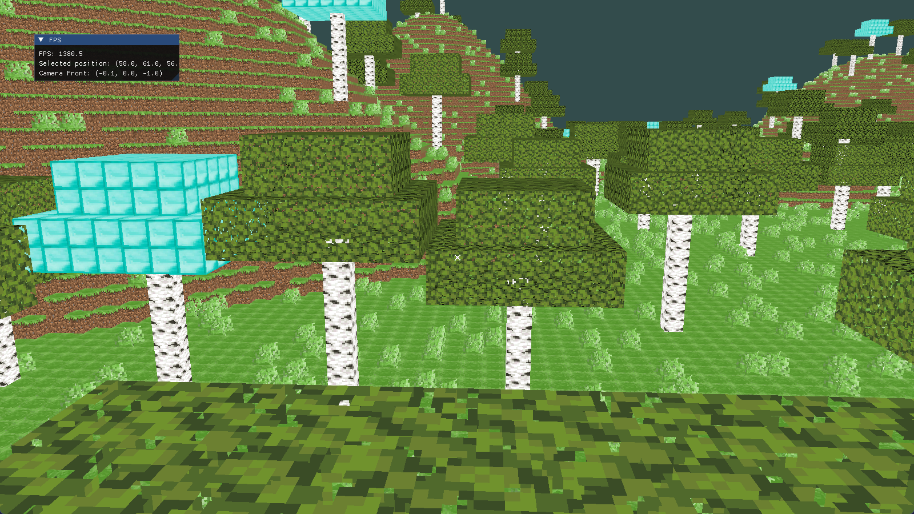
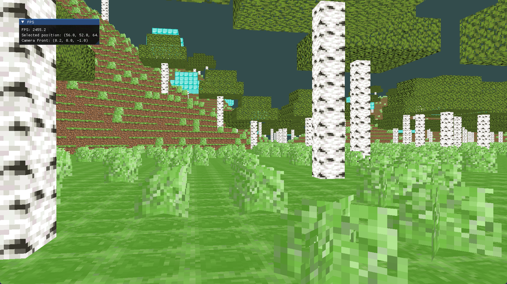

# Results

## Render
- 光照
  - [ ] 太阳光
- 阴影
    - [ ] ShadowMap
    - [ ] PCF & PCSS
- 水体渲染
  - [ ] 透明
  - [ ] SSR
- [ ] 骨骼动画
- [ ] Bloom
- [ ] 体积云

## Map
- [ ] 重构地图生成 - 以统一种子生成
- [ ] 地图分层噪声地形生成
- [ ] 河流模拟生成
- [ ] 动态地图加载
- [ ] 地图存储

# GamePlay
- [ ] 放置物体
- [ ] 破坏物体

# 优化
- 剔除

上图未开启剔除，下图开启了剔除，猛涨一千多帧。