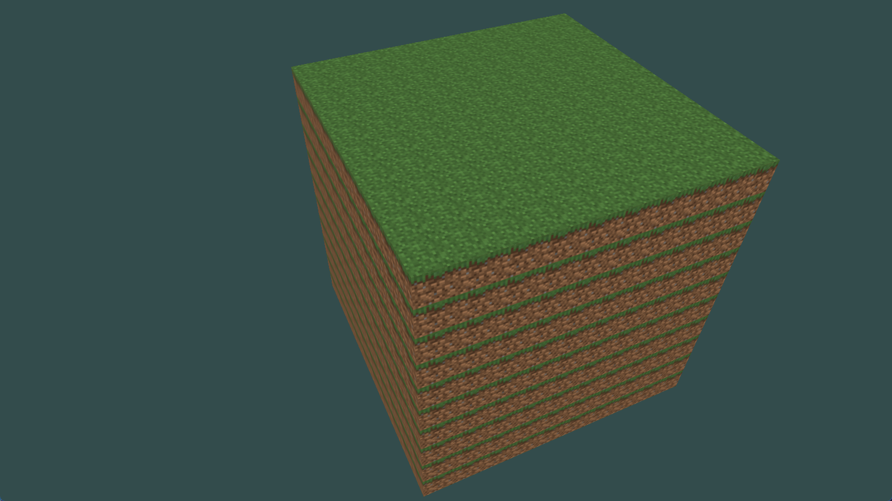

## [2024.7.9]
1. 找到草块资源。尝试渲染单一方块。
2. 封装GLFW，GL的渲染过程至Scene类中。暴露地图接口。
3. 渲染成块地图。
   

- Todo ：
  - 实现日志类，将代码中所有cout替换为规定日志输出。
  - 柏林噪声地图生成。
  - 屏幕中心准星绘制。
  - 界面系统的选定。
  - 更多方块资源的搜集。

## [2024.7.10]
1. 界面系统选定ImGUI。已经测试好导入。
2. 重构地图数据结构和渲染方式，采用Chunk来一次性渲染
  - 一个chunk包含16x256x16个Cube，初始化时来构建chunk的网格，一个chunk拥有一个VAO。
  - 游戏时，对于添加和破坏方块，会单纯更新添加 方块和破坏方块所在的chunk。

- 今日结果：
  - 重构Chunk完成，实现6000个方块从20fps到140fps的优化。
  
## [2024.7.11]
1. 替换了所有的LOG
2. 将Chunk生成进一步完善，暴露了Map生成窗口。
3. 将六张2D texture转为了一张cubemap，目前最多支持一次渲染30种方块。

## [2024.9.14]
1. 启动项目
2. 增加注释