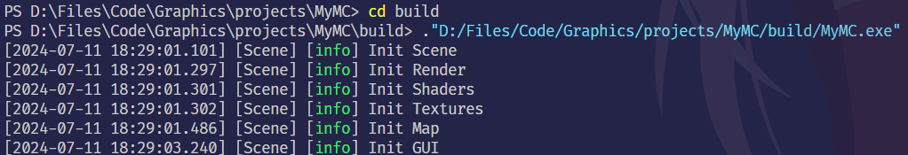

# MyMC
2022级华中科技大学软工项目。使用C++ &amp;&amp; OpenGL搭建的MC。

## 小组成员
登录名 | 姓名 |分工  |贡献
------------ | ------------- |------------ | -------------
Zzzzzya | 赵亦安  | 负责总体架构设计和框架实现。负责渲染部分所有内容。负责网页实现。  | $25$% 
Gresham429 | 陈薛嘉  | 负责GamePlay部分，负责地图存档功能。  |   $25$% 
hins | 何志鑫 | 负责UI设计和实现，负责文档整理  |  $25$% 
tr | 唐锐 | 负责GamePlay部分，负责地图存档功能 | $25$% 

## Latest下载
[Release v1.01](https://github.com/Zzzzzya/MyMC/releases/tag/release-v1.0.0)

## 介绍
游戏详细介绍参见[我的博客](http://zyaaaaa.cn/2024/09/27/MyMC/)

## 编译
### 环境搭建
参考[vcpkg搭建文档](Game/docs/vcpkg.md)

### 编译Tips 
1. 请确保你的运行目录在build下  Please ensure your working directory is under build.
   
