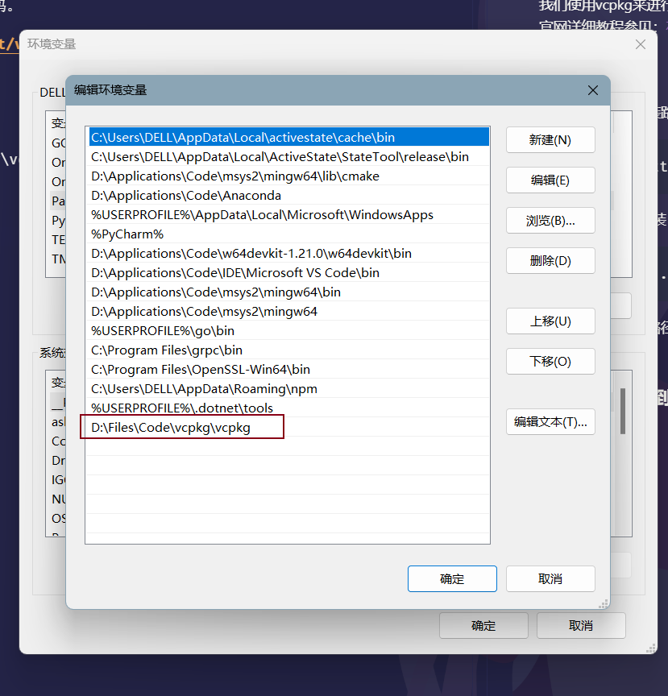
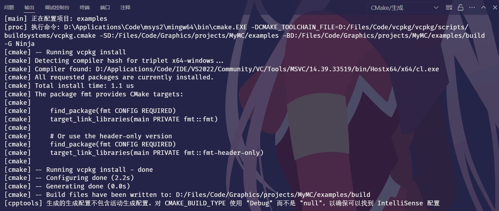
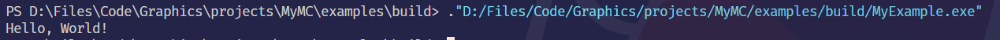

# vcpkg环境搭建
## vcpkg
我们使用vcpkg来进行C++包管理。 \
官网详细教程参见：[在 Visual Studio Code 中通过 CMake 安装和使用包](https://learn.microsoft.com/zh-cn/vcpkg/get_started/get-started-vscode?pivots=shell-bash)
### 1.安装vcpkg
确定好vcpkg的安装路径，从git上克隆vcpkg源码。
```bash
git clone https://github.com/microsoft/vcpkg.git
```
启动执行脚本并安装
```bash
cd vcpkg && ./bootstrap-vcpkg.sh
```
本人的vcpkg安装路径为D:\Files\Code\vcpkg\vcpkg，作为示例。之后的相关配置中出现这一路径的请自己替换为自己的vcpkg的安装路径。

### 2.将vcpkg加入到环境变量中
如图


加入后打开powershell，输入
```bash
vcpkg --version
```
类似于以下输出即为vcpkg成功安装并加入环境变量。
```bash
(base) C:\Users\DELL>vcpkg --version
vcpkg package management program version 2024-04-23-d6945642ee5c3076addd1a42c331bbf4cfc97457

See LICENSE.txt for license information.
```

## Vscode + Cmake
请检查自己有C++和Cmake的全套插件。
### 1.  .vscode文件
请参阅examples文件夹下的.vscode中的文件。\
其中settings.json中，从上到下分别为clangd-format的设置，cpp的设置，vcpkg的设置和单词的设置。\
一般来说只需要往你原来的settings.json中加入vcpkg的设置（如下json段）即可，其他的可以复制我的也可以自定义或者不要。记得替换为自己的vcpkg的位置下的vcpkg.cmake的位置。
```bash vcpkg设置
 "cmake.configureSettings": {
    "CMAKE_TOOLCHAIN_FILE": "D:/Files/Code/vcpkg/vcpkg/scripts/buildsystems/vcpkg.cmake"
  },
```
task.json可以自己生成。如果vscode无法生成，那么可以复制我的，然后修改你的g++地址。task.json主要用于调试用，可以在Example中自己试试打个断点然后调试程序。

### 2. Cmake
Cmake需要我们自己添加CMakePresets.json和CMakeUserPresets.json。由于两个文件也是自定义的，所以会被gitignore掉。可以参照example中提供的来创建。\
然后将CMakePresets.json中的CMAKE_TOOLCHAIN_FILE和CMakeUserPresets中的VCPKG_ROOT都改为自己vcpkg目录下的对应的文件地址即可。


## Try Example
使用vscode打开此目录下的example文件夹，里面是一个完整的使用vcpkg导入包的小程序。打开后，自己修改.vscode和CMakePresets，CmakeUserPresets中对应的vcpkg的地址。保存后，使用Cmake的build命令，选择default预设。配置好之后选择Cmake运行，输出Hello World。\
Example正确运行后，将你正确的.vscode和两个CMake的json复制到主目录下即可以运行主代码。\
ps:CMake在你正确修改文件之前可能会配置存有缓存，在你修改所有配置文件后如果不能成功配置，把build目录全删了然后重新选择cmake预设重新配置多试几次。\
正确的Cmake配置输出大致如下：

Example输出：
